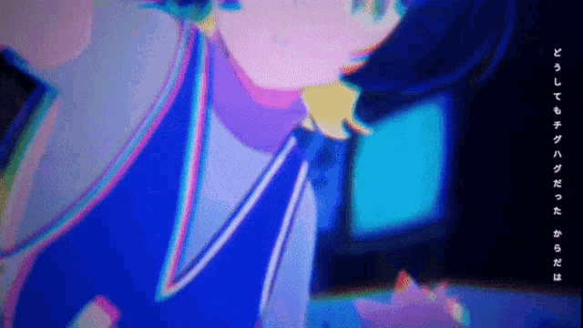

---

👋 Hi, I'm Septio Nugroho, a Computer Science student at Universitas Indonesia.
 
 
I'm passionate about building reliable, maintainable, and scalable web applications. My primary language is Golang, and I have a strong foundation in it. I'm currently exploring full-stack development and constantly expanding my skills in DevOps, Linux, and cloud technologies.

I use Arch, btw!
 
 

 
<be>

### 📝 Find me at [Medium Blog](https://septio.medium.com/)
